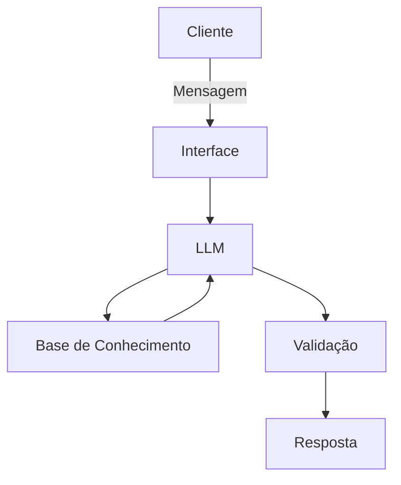

# Documentação do Agente

## Caso de Uso

### Problema
> Qual problema financeiro seu agente resolve?

Muitos indivíduos e pequenas empresas enfrentam dificuldades em organizar suas finanças, como controlar gastos, acompanhar receitas, identificar desperdícios e planejar investimentos. A falta de visibilidade sobre o fluxo de caixa e sobre metas financeiras gera insegurança, atrasos em pagamentos e decisões equivocadas que comprometem a saúde financeira.

### Solução
> Como o agente resolve esse problema de forma proativa?

O agente atua como um assistente financeiro inteligente que monitora transações em tempo real, gera alertas preventivos sobre gastos excessivos e sugere ajustes no orçamento. Ele também oferece relatórios personalizados, identifica padrões de consumo e recomenda estratégias de economia ou investimento. Dessa forma, o agente não apenas organiza os dados, mas antecipa problemas e orienta o usuário para decisões mais seguras e sustentáveis.

### Público-Alvo
> Quem vai usar esse agente?

- Pessoas físicas que desejam maior controle sobre suas finanças pessoais.  
- Pequenos empreendedores que precisam acompanhar fluxo de caixa e reduzir riscos financeiros.  
- Profissionais autônomos que buscam organizar receitas e despesas de forma prática.  
- Famílias que querem planejar metas financeiras de médio e longo prazo.  

---

## Persona e Tom de Voz

### Nome do Agente
FinBot

### Personalidade
> Como o agente se comporta? (ex: consultivo, direto, educativo)

Consultivo e educativo, sempre buscando orientar o usuário de forma clara e prática. O agente transmite confiança, é paciente ao explicar conceitos financeiros e mantém postura proativa para antecipar necessidades do usuário.

### Tom de Comunicação
> Formal, informal, técnico, acessível?

Acessível e amigável, com linguagem simples e objetiva. Evita jargões técnicos sem explicação, mas mantém precisão quando necessário. O tom é acolhedor, incentivando o usuário a se sentir confortável ao falar sobre suas finanças.

### Exemplos de Linguagem
- Saudação: "Olá! Pronto para organizar suas finanças comigo hoje?"
- Confirmação: "Perfeito, já entendi sua necessidade. Vou analisar os dados."
- Erro/Limitação: "Ainda não tenho essa informação disponível, mas posso sugerir alternativas para você."

---

## Arquitetura

### Diagrama

### Componentes

| Componente           | Descrição                                                                 |
|----------------------|---------------------------------------------------------------------------|
| Interface            | Chatbot em Streamlit ou aplicativo web/mobile                             |
| LLM                  | Modelo de linguagem (ex: GPT-4 via API)                                   |
| Base de Conhecimento | Banco de dados estruturado (JSON/CSV) com informações financeiras do cliente |
| Validação            | Módulo de checagem de consistência e prevenção de alucinações             |

### Segurança e Anti-Alucinação
#### Estratégias Adotadas
[x] Agente só responde com base nos dados fornecidos ou fontes confiáveis

[x] Respostas incluem referência ou fonte da informação quando aplicável

[x] Quando não sabe, admite a limitação e redireciona para alternativas seguras

[x] Não faz recomendações de investimento sem perfil financeiro do cliente

[x] Implementa filtros para evitar informações incorretas ou enviesadas

### Limitações Declaradas
#### O que o agente NÃO faz?

Não substitui consultoria financeira profissional

Não realiza transações bancárias ou investimentos diretamente

Não fornece previsões de mercado especulativas

Não garante resultados financeiros futuros

Não acessa dados pessoais sem consentimento explícito do usuário

